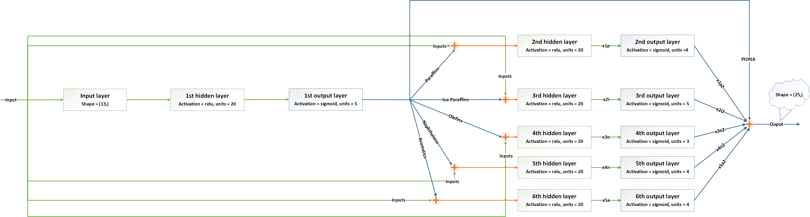
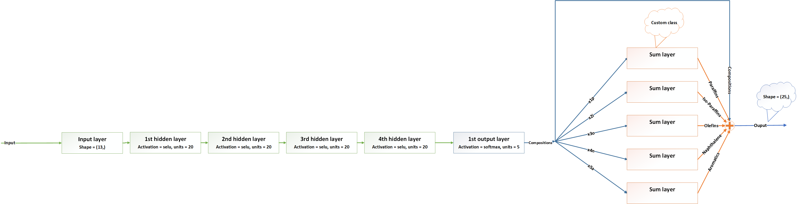
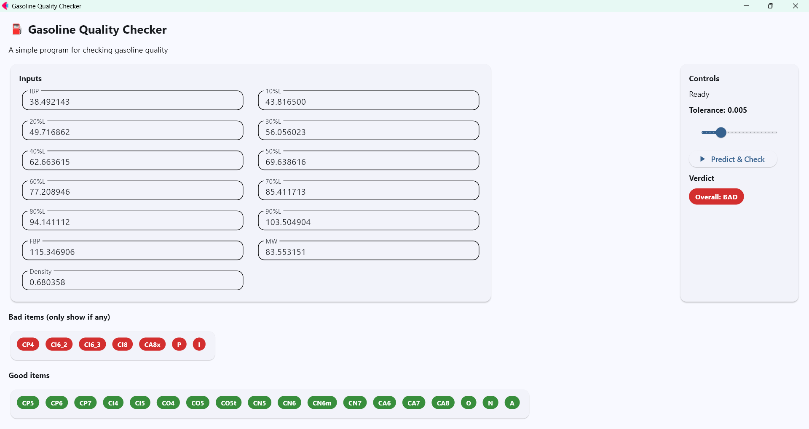

# HYSYS-Coupled Neural Network for Gasoline Composition Inference

An end-to-end computational workflow combining **Aspen HYSYS**, **Python automation**, and **TensorFlow/Keras neural networks** to infer gasoline composition from ASTM-D86 distillation data and other measurable fuel properties.

The project includes:

- automated synthetic data generation through Aspen HYSYS
- Python–HYSYS COM integration
- constrained random gasoline-composition generation
- neural-network training and validation
- prediction of individual hydrocarbon fractions
- prediction of PIONA composition
- gasoline-quality assessment
- an interactive Flet graphical interface

This project was developed as part of the **Artificial Intelligence Applications in Chemical Engineering** course at Sharif University of Technology.

---

## Overview

Determining detailed gasoline composition normally requires more specialized analytical measurements.

This project investigates whether a neural network can infer gasoline composition from more accessible bulk and distillation properties.

The model uses **13 input features**:

- Initial Boiling Point (IBP)
- 10% distillation temperature
- 20% distillation temperature
- 30% distillation temperature
- 40% distillation temperature
- 50% distillation temperature
- 60% distillation temperature
- 70% distillation temperature
- 80% distillation temperature
- 90% distillation temperature
- Final Boiling Point (FBP)
- molecular weight
- density

The neural network predicts **25 outputs**:

- mole fractions of 20 representative gasoline components
- five PIONA-group fractions:
  - Paraffins
  - Isoparaffins
  - Olefins
  - Naphthenes
  - Aromatics

The overall workflow is:

```text
Gasoline composition
        ↓
Aspen HYSYS simulation
        ↓
ASTM-D86 + MW + Density
        ↓
Generated training dataset
        ↓
TensorFlow/Keras neural network
        ↓
20 component fractions + PIONA fractions
        ↓
Gasoline quality assessment
        ↓
Flet GUI
```

---

# Aspen HYSYS Data Generation

A major part of the project is the automated generation of training data.

A gasoline mixture containing representative components from the PIONA classes is simulated in Aspen HYSYS.

Python communicates directly with HYSYS using the Windows COM interface.

For each generated sample, the program:

1. generates a physically constrained gasoline composition
2. transfers the composition to the HYSYS material stream
3. runs the HYSYS solver
4. extracts simulated ASTM-D86 temperatures
5. extracts molecular-weight and density information
6. stores the simulation inputs and outputs in a dataset

The implementation is available in:

```text
data_generation/generate_hysys_dataset.py
```

---

## Constrained Composition Sampling

Gasoline compositions cannot be generated as arbitrary random numbers because:

- every component must remain inside an allowable range
- all component mole fractions must be non-negative
- the total mole fraction must equal 1
- the composition should vary across the PIONA groups

The data-generation algorithm therefore samples compositions subject to these constraints.

A capped-simplex projection method is used to produce feasible composition vectors while preserving component bounds.

The sampling procedure also varies the relative distribution between:

```text
P / I / O / N / A
```

and then distributes each group fraction among its constituent hydrocarbons.

---

# Dataset

The full training dataset was produced from multiple automated Aspen HYSYS simulation runs.

For repository size and portability, this repository contains a **representative subset** of the generated dataset:

```text
data/
├── Inputs4_sample.csv
└── Outputs4_sample.csv
```

The rows of these two files correspond directly to each other.

### Inputs

Each row contains the 13 neural-network inputs:

```text
IBP
10%L
20%L
30%L
40%L
50%L
60%L
70%L
80%L
90%L
FBP
MW
Density
```

### Outputs

Each corresponding row contains:

```text
20 individual component mole fractions
+
5 PIONA-group mole fractions
```

The complete dataset can be regenerated using the HYSYS data-generation pipeline.

> Aspen HYSYS and Windows COM support are required to reproduce the complete simulation-generated dataset.

---

# Neural Network Modeling

The neural-network development and training workflow is contained in:

```text
training/train_neural_network.ipynb
```

The project investigates structured neural-network architectures rather than using only a single fully connected output layer.

---

## Architecture 1

The first architecture predicts the five PIONA group fractions and then uses this information together with the original process inputs to predict the individual components belonging to each group.



The architecture contains:

- 13 process-property inputs
- hidden layers with nonlinear activation functions
- an intermediate PIONA representation
- separate component-prediction branches
- a final 25-element output vector

This creates a hierarchical relationship between group-level and component-level predictions.

---

## Architecture 2

A second architecture was developed to impose a stronger structural relationship between individual components and their parent PIONA groups.



In this architecture:

1. the network first predicts the 20 individual component fractions
2. the component outputs are separated according to their PIONA classes
3. custom summation layers calculate the PIONA group fractions directly from the predicted components

Therefore,

\[
P = \sum_i x_{P,i}
\]

\[
I = \sum_i x_{I,i}
\]

\[
O = \sum_i x_{O,i}
\]

\[
N = \sum_i x_{N,i}
\]

\[
A = \sum_i x_{A,i}
\]

This architecture embeds part of the known composition structure directly into the model.

The implementation uses:

- SELU hidden-layer activations
- Softmax-based component prediction
- custom TensorFlow/Keras layers
- structured output aggregation

---

# Training and Evaluation

The generated dataset is shuffled and divided into:

```text
Training data
Validation data
Test data
```

Input variables are normalized before training.

Several evaluation quantities are used to assess model performance, including:

- Huber loss
- Mean Squared Error (MSE)
- Mean Absolute Error (MAE)
- Root Mean Squared Error (RMSE)
- Relative Error
- SMAPE

The model is also checked for physically meaningful output behavior, including:

- non-negative composition predictions
- component fractions summing approximately to unity
- PIONA fractions summing approximately to unity
- consistency between predicted group fractions and their constituent components

---

# Gasoline Quality Assessment

After predicting the composition, the model evaluates whether the resulting gasoline falls within predefined composition ranges.

The quality checker evaluates both:

### Individual components

Examples include:

```text
n-butane
n-pentane
n-hexane
isobutane
isopentane
iso-octane
benzene
toluene
ethylbenzene
p-xylene
...
```

### PIONA groups

```text
P — Paraffins
I — Isoparaffins
O — Olefins
N — Naphthenes
A — Aromatics
```

Each prediction is labeled:

```text
GOOD
```

or

```text
BAD
```

according to its acceptable composition range.

A user-defined tolerance can also be applied to these ranges.

---

# Graphical User Interface

The trained model was deployed in an interactive desktop interface using **Flet**.



The user enters:

- ASTM-D86 temperatures
- molecular weight
- density

The application then:

1. normalizes the input data
2. loads the trained TensorFlow/Keras model
3. predicts the detailed gasoline composition
4. evaluates the predicted component and PIONA fractions
5. displays the overall gasoline-quality verdict
6. identifies which predicted components satisfy or violate the defined ranges

The interface also provides:

- adjustable quality tolerance
- GOOD/BAD component indicators
- asynchronous model loading
- loading and prediction status
- input validation
- error handling

---

# Project Structure

```text
hysys-neural-gasoline-quality/
│
├── README.md
├── requirements.txt
├── .gitignore
│
├── app/
│   ├── gasoline_quality_app.py
│   ├── selus.keras
│   └── MinMax_train.csv
│
├── training/
│   └── train_neural_network.ipynb
│
├── data_generation/
│   └── generate_hysys_dataset.py
│
├── data/
│   ├── Inputs4_sample.csv
│   └── Outputs4_sample.csv
│
├── hysys/
│   └── Simulation_Columns_Copy.hsc
│
└── figures/
    ├── network_architecture_1.png
    ├── network_architecture_2.png
    └── gui_screenshot.png
```

---

# Installation

Install the required Python packages:

```bash
pip install -r requirements.txt
```

A typical `requirements.txt` contains:

```text
numpy
pandas
matplotlib
scikit-learn
tensorflow
flet
pywin32
```

---

# Running the Neural-Network Application

Run:

```bash
python app/gasoline_quality_app.py
```

The application loads:

```text
app/selus.keras
app/MinMax_train.csv
```

and opens the Gasoline Quality Checker interface.

---

# Regenerating the Dataset

To generate new data using Aspen HYSYS:

```bash
python data_generation/generate_hysys_dataset.py
```

This stage requires:

- Windows
- Aspen HYSYS
- `pywin32`
- the supplied HYSYS simulation case

The script connects to HYSYS using COM automation, modifies the feed composition, executes the solver, extracts process results, and stores the generated samples in CSV format.

---

# Technologies

### Process Simulation

- Aspen HYSYS
- ASTM-D86 simulation
- petroleum-mixture modeling

### Machine Learning

- TensorFlow
- Keras
- neural networks
- structured neural-network architectures
- regression
- custom Keras layers

### Data Engineering

- Python
- pandas
- NumPy
- automated synthetic-data generation
- constrained composition sampling

### Software

- Flet
- Python COM automation
- Jupyter Notebook

---

# Project Highlights

This project demonstrates an end-to-end computational workflow combining:

- chemical-process simulation
- automated engineering-data generation
- Python–Aspen HYSYS integration
- constrained sampling of physically feasible mixtures
- neural-network architecture design
- physics/structure-informed output relationships
- model validation
- deployment of a trained machine-learning model
- interactive engineering software development

The project illustrates how process simulation and machine learning can be combined to create a computational alternative for inferring detailed process/product information from more readily available measurements.

---

# Authors

**Mohammad Mahdi Saeedi**  

Sharif University of Technology  
Department of Chemical and Petroleum Engineering
